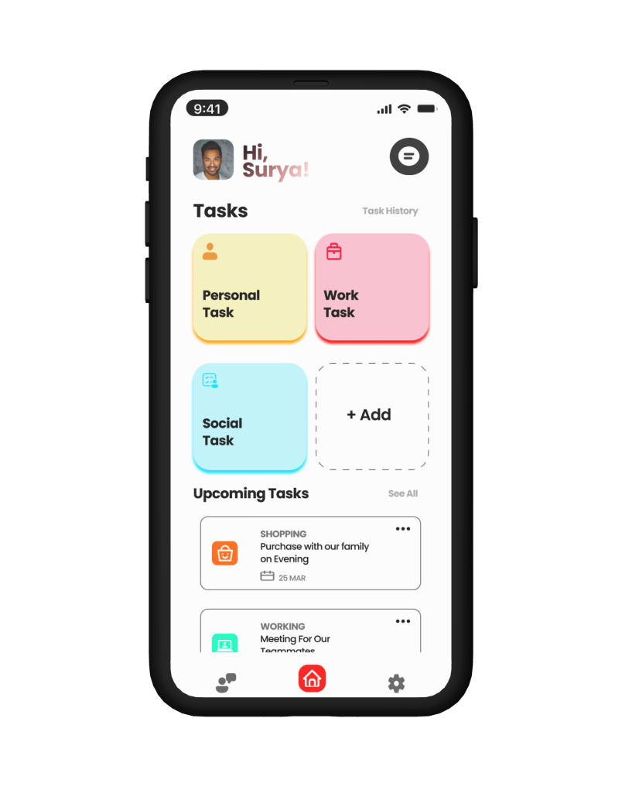

# Do-Done-Task-Management-Mobile-App-Ui-Design

Welcome to my Figma UI Design Repository! This repository contains the design assets and documentation for my UI design project created in Figma.

## Design Preview

*Include a brief description of your design and a preview image.*

## Key Features

- **Responsive Design:** Ensure a consistent user experience across various screen sizes.
- **Intuitive Navigation:** Implement a user-friendly navigation system.
- **Color Harmony:** Curate a color palette to evoke desired emotions.

*List the key features of your design.*

## Getting Started

1. Clone the repository: https://github.com/RMMagesh07/Do-Done-Task-Management-Mobile-App-UiDesign
2. Open the `docs` folder to view exported design assets.
3. Visit [GitHub Pages](https://github.com/RMMagesh07/Do-Done-Task-Management-Mobile-App-UiDesign) to see the live design preview.

*Include instructions on how to get started with your design.*

## Feedback

I welcome your feedback, suggestions, and thoughts on the design. Feel free to [open an issue](https://github.com/yourusername/your-repository/issues) or connect with me on [LinkedIn](https://www.linkedin.com/in/rm-magesh-575293255/).

*Encourage users to provide feedback.*

Thank you for checking out my UI design! If you have any questions or feedback, don't hesitate to reach out.
